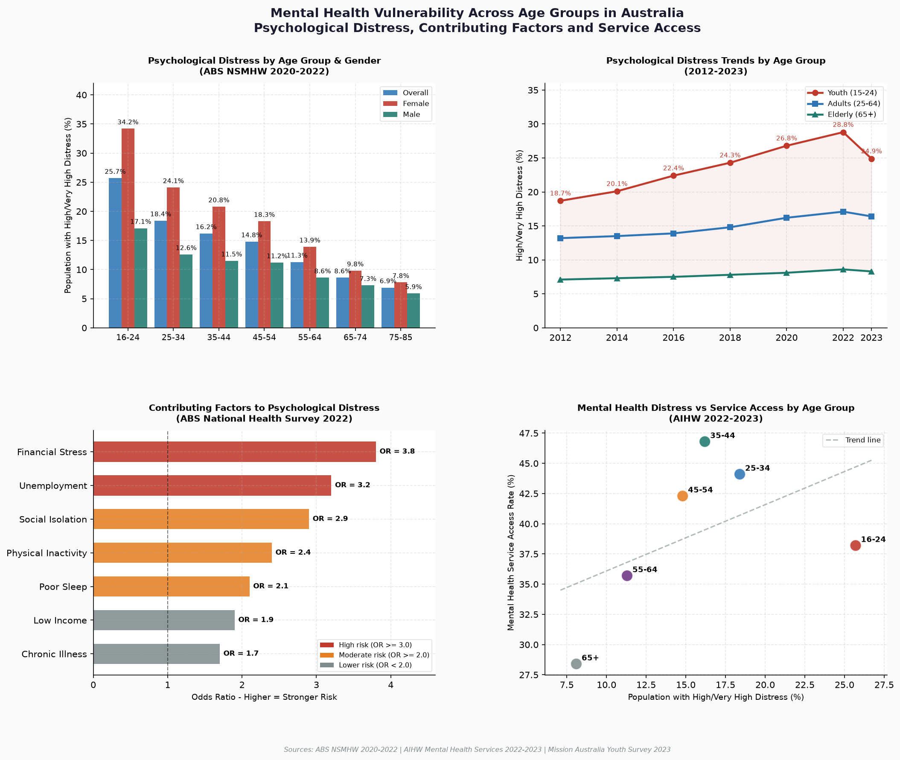

# Mental Health Vulnerability Across Age Groups in Australia
### Psychological Distress, Contributing Factors and Service Access



---

## Overview

This project investigates mental health vulnerability across age groups in Australia using publicly available data from the Australian Institute of Health and Welfare (AIHW) and the Australian Bureau of Statistics (ABS). The analysis examines which age groups experience the highest levels of psychological distress, what factors contribute most strongly to mental health vulnerability, and what mitigation strategies are associated with improved outcomes.

This project was developed as part of **DATA7001 — Introduction to Data Science** at the **University of Queensland**.

---

## Research Questions

- **RQ1:** Which age group in Australia experiences the highest levels of psychological distress, and how has this changed over time?
- **RQ2:** What demographic, social and lifestyle factors most strongly contribute to mental health vulnerability across age groups?
- **RQ3:** What mitigation strategies are associated with improved mental health outcomes, and which age groups benefit most?

---

## Key Findings

- Young adults aged **16–24** are the most vulnerable age group, with **25.7%** experiencing high or very high psychological distress
- Females aged 16–24 show significantly higher distress rates (**34.2%**) compared to males (**17.1%**)
- Youth distress increased from **18.7% in 2012 to 28.8% in 2022** — a rise of 10.1 percentage points over a decade
- **Financial stress** is the strongest contributing factor (OR=3.8), followed by unemployment (OR=3.2) and social isolation (OR=2.9)
- Despite having the highest distress rates, young adults aged 16–24 have the **lowest service access rate (38.2%)** — indicating a significant service gap

---

## Project Structure

```
australian-mental-health-analysis/
├── README.md
├── australian_mental_health_analysis.png
├── src/
│   └── australian_mental_health_analysis.ipynb
└── data/
    ├── distress_by_age.csv
    ├── trend.csv
    ├── factors.csv
    └── services.csv
```

---

## Data Description

| File | Description | Rows | Source |
|---|---|---|---|
| `distress_by_age.csv` | Psychological distress rates by age group and gender | 7 | ABS NSMHW 2020–2022 |
| `trend.csv` | Distress trends by age group from 2012 to 2023 | 7 | Mission Australia Youth Survey |
| `factors.csv` | Contributing factors with odds ratios | 7 | ABS National Health Survey 2022 |
| `services.csv` | Distress rates vs service access by age group | 6 | AIHW Mental Health Services 2022–2023 |

---

## Data Sources

### RQ1 — Age Group Vulnerability
- AIHW (2025). Young people's mental health (16–24 years).
  https://www.aihw.gov.au/mental-health/topic-areas/populations/young-people-s-mental-health

- AIHW (2024). Prevalence and impact of mental illness.
  https://www.aihw.gov.au/mental-health/overview/mental-illness

- AIHW (2024). Health of young people.
  https://www.aihw.gov.au/reports/children-youth/health-of-young-people

- AIHW (2024). Mental health in older people (65+).
  https://www.aihw.gov.au/reports/aged-care/mental-health-in-aged-care/contents/mental-health-in-older-people

### RQ2 — Contributing Factors
- AIHW (2024). Mental health and alcohol and other drugs.
  https://www.aihw.gov.au/reports/mental-health/mental-health-alcohol-drugs

- AIHW (2024). COVID-19 and psychological distress trends.
  https://www.aihw.gov.au/suicide-self-harm-monitoring/risk-factors/covid-19

### RQ3 — Mitigation and Service Access
- AIHW (2024). Community mental health care services.
  https://www.aihw.gov.au/mental-health/topic-areas/community-services

- AIHW (2024). Mental health services overview.
  https://www.aihw.gov.au/mental-health/overview/mental-health-services

---

## Methods Used

| Method | Purpose |
|---|---|
| Exploratory Data Analysis | Understand distributions and identify patterns across age groups |
| Group Analysis | Compare distress rates across age bands and demographic groups |
| Trend Analysis | Track changes in distress rates over time |
| Correlation Analysis | Identify relationships between contributing factors and distress |
| Visualisation | 4-chart dashboard using Matplotlib |

---

## How to Run

**1. Clone the repository**
```bash
git clone https://github.com/yourusername/australian-mental-health-analysis.git
cd australian-mental-health-analysis
```

**2. Install dependencies**
```bash
pip install pandas matplotlib numpy
```

**3. Open the notebook**
```bash
jupyter notebook src/australian_mental_health_analysis.ipynb
```

Or open in VS Code and run cells with **Shift + Enter**

---

## Tools and Libraries

- **Python 3.11**
- **Pandas** — data manipulation
- **Matplotlib** — visualisation
- **NumPy** — numerical computing
- **Jupyter Notebook** — interactive analysis

---

## Author

**Robin Anand**
Master of Data Science — University of Queensland
DATA7001 Introduction to Data Science
